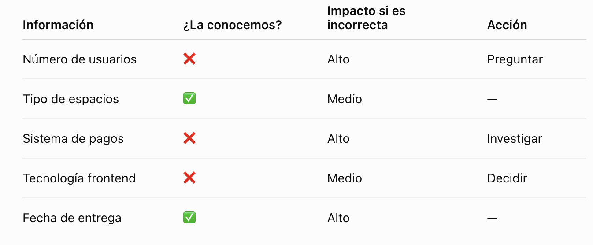

# 🧪 ¿Es viable nuestro proyecto?

## Paso 1. Recibimos el reto

## Paso 2. Descubrir información

Debemos identificar:

- Qué sabemos
- Qué no sabemos
- Qué necesitamos preguntar
- Qué estamos suponiendo

Vamos a realizar una **matriz de incertidumbres:**

