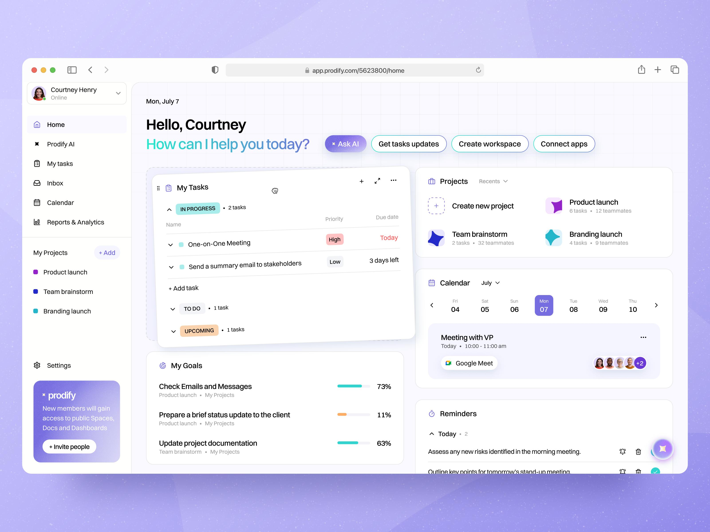
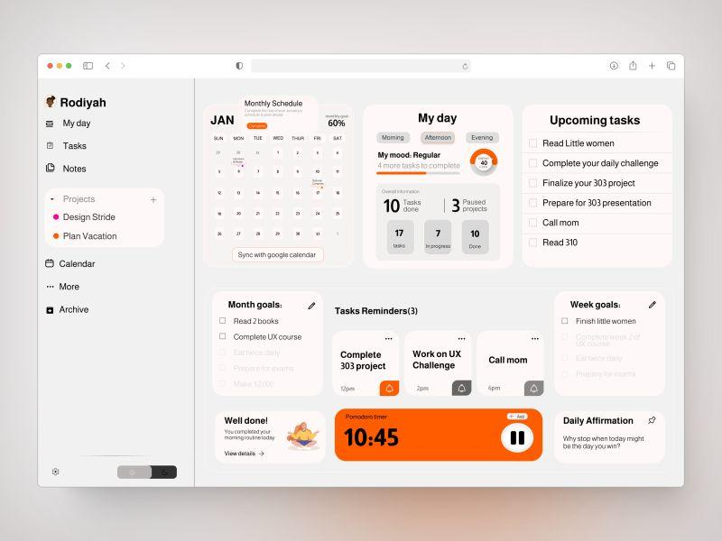
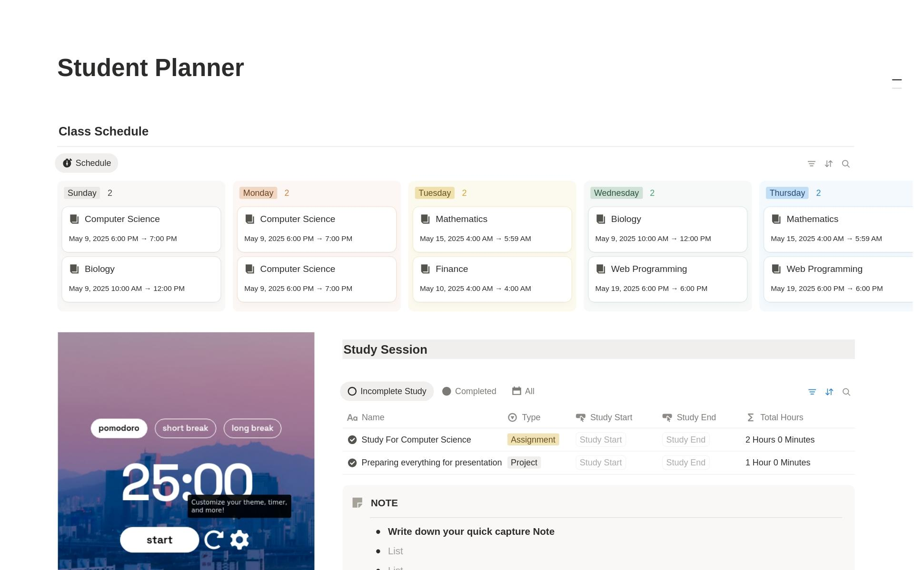
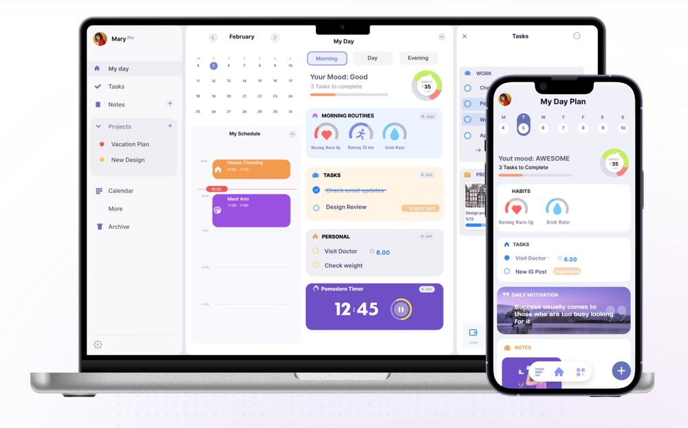

# 🚀 Desafío 1 · LifeOS - Tu vida digital

El alumnado debe desarrollar una aplicación web llamada provisionalmente **LifeOS,** pero realmente cada alumno elegirá su nombre. 

Será una especie de **dashboard personal** para organizar planes, actividades, pequeños gastos, hábitos y objetivos.

# 🧩 Reto

>💡
>Deberás diseñar y desarrollar una aplicación web que ayude a una persona a organizar su vida diaria desde un único lugar.
>

La aplicación debería permitir, como mínimo:

- 📅 organizar planes y eventos
- ✅ gestionar tareas
- 💰 controlar pequeños gastos
- 📝 registrar información personal
- 📊 visualizar un resumen de su situación
- 💾 conservar los datos aunque cierre el navegador

Queremos realizar una **SPA sencilla**, desarrollada inicialmente con **JavaScript + Vanilla + Vite,** donde diferentes funcionalidades comparten datos y estado.

Ejemplos que te pueden dar ideas:

