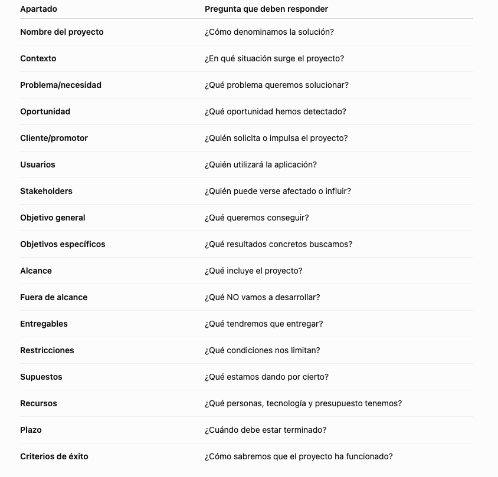
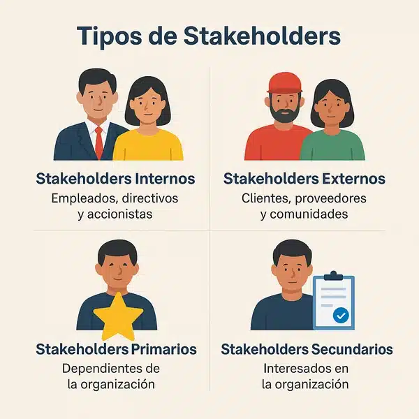
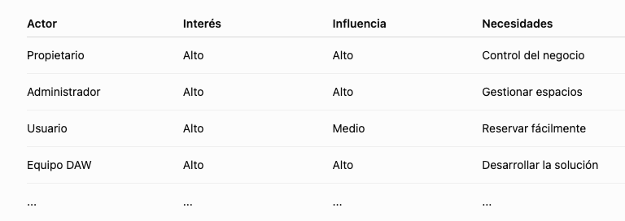
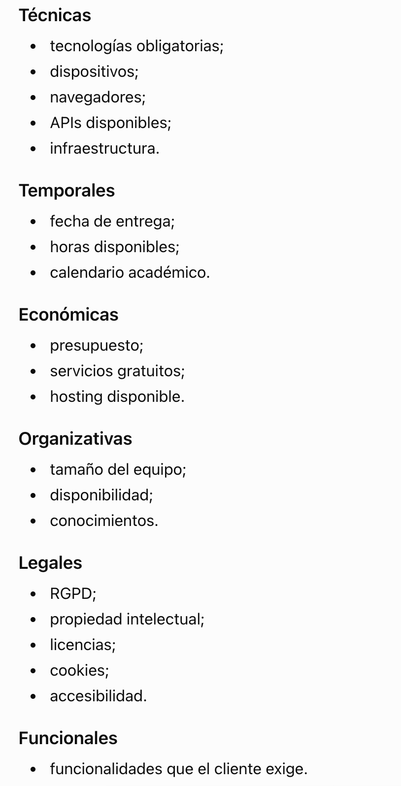
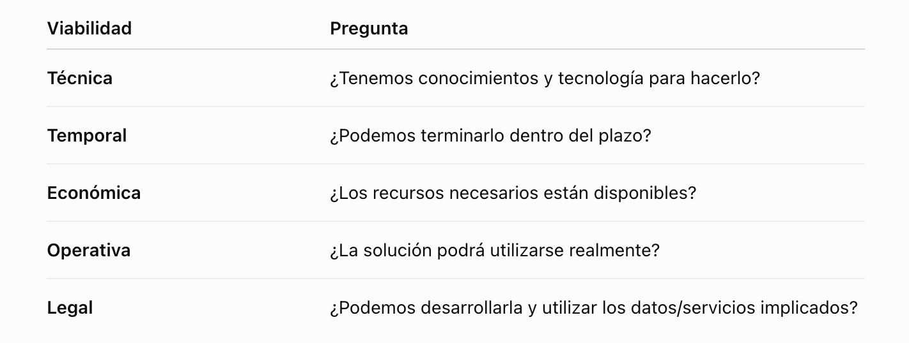
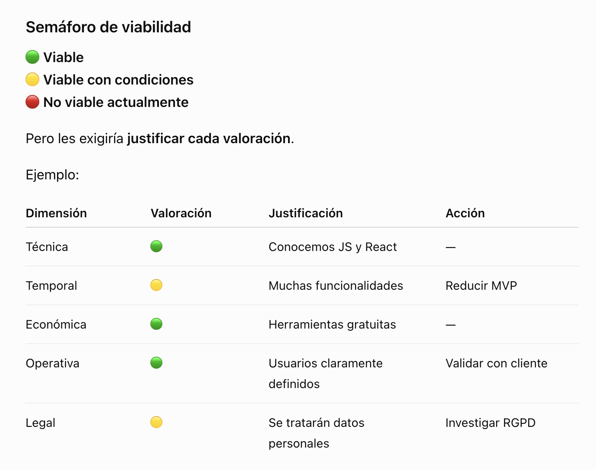

# 🧪 ¿Es viable nuestro proyecto?

## Paso 1. Recibimos el reto

## Paso 2. Descubrir información

Debemos identificar:

- Qué sabemos
- Qué no sabemos
- Qué necesitamos preguntar
- Qué estamos suponiendo

Vamos a realizar una **matriz de incertidumbres:**


## Paso 3. Elaborar Briefing

Construimos:

**contexto→problema→actores→objetivos→alcance→entregables→restricciones→recursos→plazo→éxito**

## Paso 4. Analizar viabilidad

Realizar tabla:

**Técnica / temporal / económica / operativa / legal**

## Paso 5 - IA como “auditor”

Pasarás tu briefing a la IA pidiéndole algo como esto:

"Actúa como consultor de proyectos software. Revisa nuestro briefing. Identifica información ambigua, objetivos mal definidos, restricciones no contempladas, riesgos y preguntas que deberíamos realizar antes de iniciar el desarrollo. No propongas soluciones todavía.”

Debes analizar la respuesta y guardar el prompt que le pides en un md en la carpeta `docs`

## Paso 6. Resultado de la sesión

```jsx
proyecto-coworking/
│
├── README.md
│
└── docs/
    ├── briefing.md
    ├── viabilidad.md
    ├── incertidumbres.md
    └── ia-prompt.md
    
```

# 📜 Documentación Anexo

# Objetivo

>💡
>Deberás ser capaz de transformar una idea o necesidad inicial en un **briefing de proyecto suficientemente claro** y realizar un **primer análisis de viabilidad** antes de >empezar a desarrollar.
>

# Briefing

>💡
>¿Qué tenemos que hacer y para quién?
>

## Plantilla de un Briefing



## Identificación de actores

Debemos introducir **stakeholders** de forma muy visual.



Por ejemplo: 



### **Objetivos**

Por ejemplo:

“Desarrollar una plataforma web para gestionar reservas de espacios de coworking”

Sería un **objetivo/alcance,** mientras que:

“Aplicación web desplegada + documentación + manual de usuario”

son **entregables.**

Debemos redactarlos de forma detallada y que no sean objetivos generales ni ambiguos.

Un objetivo como:

> "Hacer una aplicación moderna."
> 

es demasiado ambiguo.

Mejor:

> "Desarrollar una aplicación web que permita a los usuarios consultar la disponibilidad de los espacios y realizar reservas."
> 

Y podemos introducir el concepto de **SMART** sin convertirlo en teoría empresarial:

- **S**pecific
- **M**easurable
- **A**chievable
- **R**elevant
- **T**ime-bound

No hace falta que todos los objetivos sean perfectamente SMART, pero sí que aprendamos a preguntarnos:

> **¿Cómo sabremos que hemos conseguido el objetivo?**
> 

## Restricciones

>💡
>¿Qué podría impedir que nuestro proyecto se realizase como inicialmente lo imaginamos?
>

Tenemos que buscar restricciones de diferentes tipos:



## Viabilidad del proyecto


>💡
>La viabilidad no es si/no. También sirve para detectar qué tenemos que cambiar antes de empezar.
>

En esta fase buscamos una **viabilidad inicial.**

Utilizamos cinco dimensiones:





MVP: Producto mínimo viable

RGPD: Reglamento General de Protección de Datos

### Herramientas que vamos a utilizar

**🧠 Para pensar y documentar**

**Markdown + Github**

```jsx
/docs/briefing.md
/docs/viabilidad.md
```

>💡
>La documentación va a formar parte del repositorio del proyecto y queda versionada
>

**📋 Para organizar**

**Github Proyects**

Todavía no vamos a tener un Product Backlog completo. Pero en esta sesión podemos:

Ideas → Análisis → Viable/No Viable

**🤖 Para IA**

Introduciría la IA con un papel concreto: **IA como consultor, no responsable de la decisión.**

**IA propone → equipo comprueba → equipo acepta/rechaza → equipo documenta**