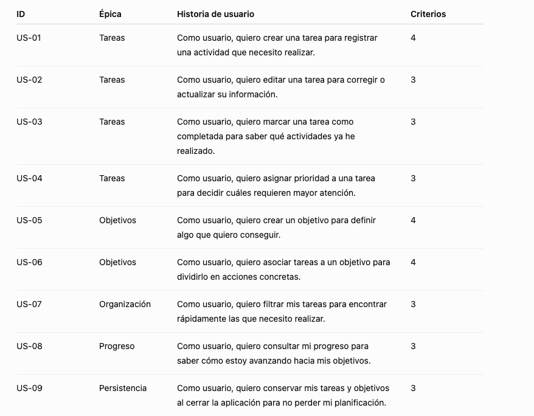

# 🧪 Problema -> Backlog

> **El briefing de LifeOS está terminado. Ahora sois el equipo de análisis. Tenéis que convertir necesidades detectadas en el primer Product Backlog del producto**

## Paso 1. Extraemos necesidades

Vamos a revisar el brefing y obtener las necesidades.

>Todos los ejemplos que aquí aparecen son sólo eso, ejemplos. No son los que debéis usar en vuestro proyecto. Tenéis que extraerlos vosotros mismos del briefing.

Por ejemplo:

```txt
N1 → Organizar tareas
N2 → Priorizar tareas
N3 → Trabajar con objetivos
N4 → Saber qué tareas están pendientes
N5 → Consultar progreso
N6 → No perder la información
```

## Paso 2. Identificar funcionalidaes

```txt
N1
├── Crear tarea
├── Editar tarea
├── Eliminar tarea
└── Completar tarea

N2
├── Asignar prioridad
└── Ordenar por prioridad

N3
├── Crear objetivo
├── Editar objetivo
├── Asociar tareas
└── Consultar progreso
```

## Paso 3. IA como analista de LifeOS

Vamos a utilizar un **prompt** muy contextualizado. Modifícalo como consideres oportuno.

```txt
Actúa como analista de requisitos de una aplicación web llamada LifeOS.

LifeOS es una aplicación de planificación personal que permite a una persona gestionar sus tareas y objetivos, organizar sus prioridades y consultar su progreso.

Este es el briefing del proyecto:

[PEGAR AQUÍ EL BRIEFING REALIZADO POR EL EQUIPO]

Estas son las necesidades que hemos identificado:

[PEGAR NECESIDADES]

Ayúdanos a analizarlas.

Para cada necesidad:

1. Identifica qué problema del usuario intenta resolver.
2. Propón las funcionalidades que debería ofrecer la aplicación.
3. Identifica posibles usuarios implicados.
4. Detecta ambigüedades o información que falta.
5. Indica posibles requisitos funcionales.
6. Indica posibles requisitos no funcionales cuando sean relevantes.

No inventes información que no aparezca en el briefing.
No decidas por nosotros.
Si una cuestión requiere información del cliente o del usuario, indícala como pregunta abierta.

Todavía NO redactes historias de usuario.

```

## Paso 4. IA para encontrar incoherencias => auditoría del análisis

```txt
Revisa nuestro análisis de requisitos para LifeOS.

Necesidades:
[...]

Funcionalidades:
[...]

Actúa como un analista que debe encontrar problemas.

Identifica:

* necesidades que no tienen ninguna funcionalidad asociada;
* funcionalidades que no parecen responder a ninguna necesidad;
* funcionalidades demasiado grandes;
* funcionalidades duplicadas;
* funcionalidades ambiguas;
* información que deberíamos aclarar;
* posibles requisitos que hayamos olvidado.

No añadas funcionalidades simplemente porque parezcan interesantes.
Diferencia claramente entre lo que se deduce de la información proporcionada y lo que sería una sugerencia.

```

>**La IA no sólo sirve para generar; también sirve para revisar nuestro razonamiento**

## Paso 5. Creamos las primeras historias utilizando IA

```txt
A partir exclusivamente de las funcionalidades validadas de nuestro proyecto LifeOS:

[PEGAR FUNCIONALIDADES]

Crea historias de usuario siguiendo esta estructura:

Como [tipo de usuario],
quiero [acción],
para [valor que obtengo].

Para cada historia:

* utiliza lenguaje comprensible para el usuario;
* evita describir tecnología o implementación;
* asegúrate de que aporta valor;
* indica si consideras que es demasiado grande y podría dividirse;
* propone entre 3 y 5 criterios de aceptación verificables.

No inventes funcionalidades nuevas.

```
## Resultado final

Ejemplo (**sólo un ejemplo**)



## Paso 6. Crea tu backlog en Github

