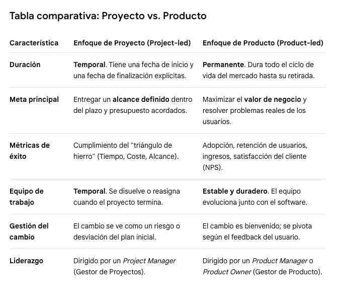
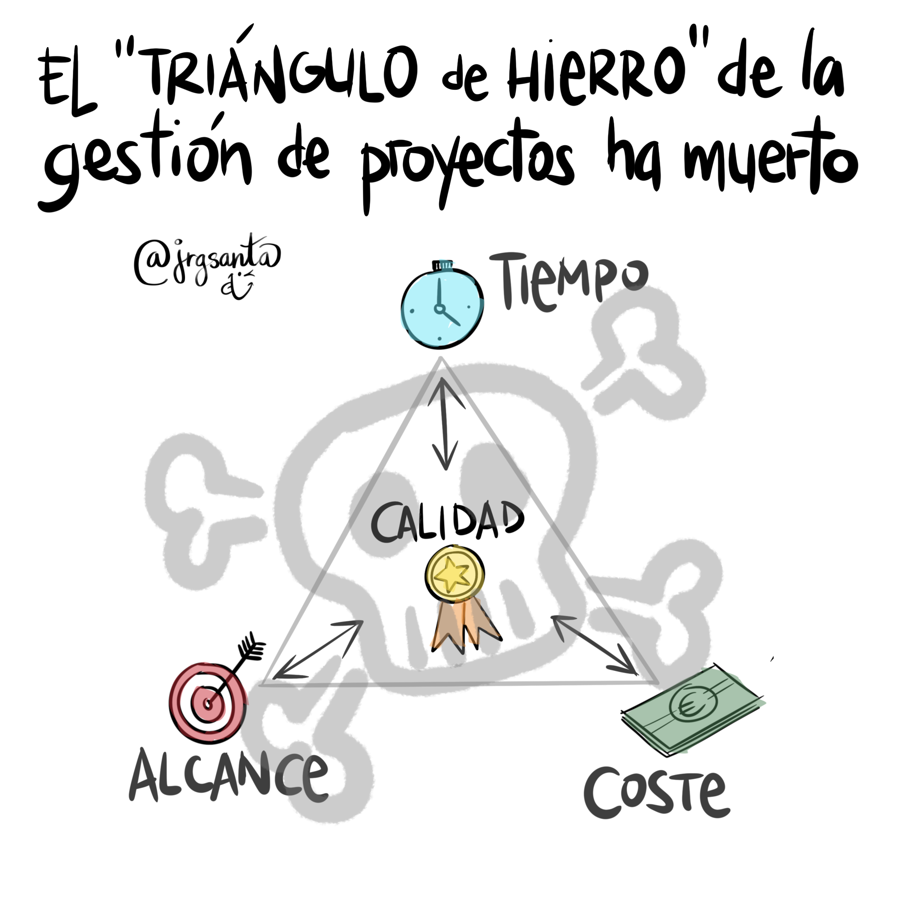
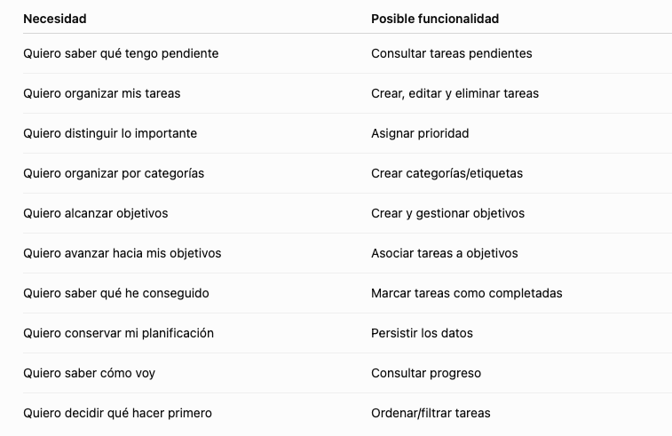

# 📚 Proyecto software

## Proyecto vs Producto

En el ámbito del software, la diferencia entre ambos radica en la mentalidad, la duración y la forma en que se mide el éxito. Mientras que un **proyecto** es un esfuerzo temporal con un principio y un fin claros, un **producto** es una entidad viva que evoluciona continuamente para generar valor a largo plazo mientras siga siendo útil para sus usuarios.

Un **proyecto sirve para construir o actualizar un producto.**

## Objetivos de un proyecto web

Son los **resultados medibles** que se esperan conseguir con la creación de la web. Responden a *¿para qué?* del proyecto.

*Ejemplo:* Lograr **1.000 ventas mensuales** en la nueva tienda online durante el primer trimestre o reducir un **30% las llamadas de soporte** mediante una sección de ayuda autogestionable.

## Alcance

Es el límite del proyecto; define detalladamente todo el trabajo que se va a realizar y, de igual importancia, lo que queda fuera.

Ejemplo: El alcance incluye el diseño de 5 páginas, pasarela de pago con tarjeta y un blog. No incluye el desarrollo de una app móvil ni la redacción de los textos legales.

## Entregables

Son los productos tangibles o verificables que se van generando y presentando a lo largo del proyecto.

Ejemplo: El documento de arquitectura de información, los wireframes (bocetos de diseño), el código fuente en GitHub, y finalmente, la web publicada y funcional.

## Restricciones

Son las limitaciones o factores restrictivos que condicionan la ejecución del proyecto. Tradicionalmente forman el "triángulo de hierro" aunque ahora ante la IA hay quien piensa que ya no se cumple del mismo modo.

Ejemplo: El presupuesto máximo es de 15.000 €, la fecha de lanzamiento límite es el 15 de diciembre, o la obligación de usar obligatoriamente la tecnología Angular / React.

## Stakeholders

Son todas las **personas, equipos u organizaciones** que se ven afectadas por el proyecto o que tienen interés en su resultado.

*Ejemplo*: El cliente (dueño del negocio), el diseñador UI/UX, el equipo de programadores, el especialista en SEO, e incluso los usuarios finales que navegarán por la web.

## Ciclo de vida de un proyecto web

El ciclo de vida abarca desde que la web es solo una idea hasta que se lanza a internet. Se compone de **6 fases secuenciales** (aunque en entornos ágiles se puede iterar continuamente entre ellas):

1. Inicio → 2. Planificación → 3. Diseño → 4. Desarrollo → 5. Pruebas → 6. Lanzamiento

### 1. Inicio (briefing y viabilidad)

Se define la idea general, se identifican los principales **stakeholders** y se alinean las expectativas. Se aprueba la viabilidad del proyecto mediante un acta de constitución (Project Charter).

### 2.  Planificación (definición y estructura)

Se detalla el **alcance**, el calendario (cronograma) y el presupuesto. Aquí se crea el mapa del sitio web (sitemap) y la arquitectura de la información para saber qué páginas tendrá el sitio y cómo se conectarán.

### 3. Diseño (UI/UX)

Se define el aspecto visual de la web. Se crean los wireframes (esquemas en blanco y negro) y posteriormente los prototipos interactivos en alta fidelidad (en herramientas como Figma). Se valida la experiencia de usuario (**UX**) y la interfaz visual (**UI**).

### 4. Desarrollo (Programación)

Los desarrolladores traducen los diseños aprobados en código real.

- **Front-end:** La parte visual con la que interactúa el usuario (HTML, CSS, JavaScript).
- **Back-end:** La lógica interna, bases de datos, integraciones con pasarelas de pago y el panel de administración (CMS).

### 5. Pruebas (QA/Quality Assurance)

Se testea a fondo la web antes de hacerla pública. Se comprueba que funcione bien en móviles y ordenadores (responsivo), que no haya enlaces rotos, que la velocidad de carga sea óptima y que los formularios envíen la información correctamente.

### 6. Lanzamiento y cierre

La web se traslada al servidor definitivo, se vincula el dominio (ej. tuweb.com) y se indexa en Google. Se entrega la documentación al cliente, se realiza la formación si la requiere y **se cierra formalmente el proyecto**. *(A partir de aquí, la web entra en su fase de mantenimiento y evoluciona como producto).*

# 🛷 De la necesidad al requisito

## Conceptos clave

### Necesidad

La carencia u oportunidad real del usuario o del negocio (por ejemplo: “los clientes necesitan comprar productos sin llamar por teléfono”).

### Requisito funcional / no funcional

**Requisito funcional:** Lo que la aplicación **hace** (por ejemplo: “el sistema debe permitir pagar con tarjeta de crédito”).

**Requisito no funcional:** Cómo se **comporta** la aplicación en términos de calidad (por ejemplo: “la página debe cargar en menos de 2 segundos” o “los datos deben estar cifrados”).

### Alcance

Los límites del proyecto; define exactamente qué se incluye y qué se deja fuera para evitar retrasos.

### Épicas

Grandes bloques de trabajo o funcionalidades generales que se dividen en partes más pequeñas (por ejemplo: “Módulo de autenticación de usuarios”)

### Historias de usuario

Pequeñas piezas de valor contadas desde la perspectiva del usuario, usando el formato:

“Como *[rol]*, quiero *[acción]* para *[beneficio]*”.

### Criterios de aceptación

Las condiciones específicas que debe cumplir una historia de usuario para darse por buena y terminada (por ejemplo: “el botón de registro se desactiva si el correo es inválido”)

## Del problema a las necesidades

Imaginemos que tengo: *"Quiero saber qué tengo pendiente"*

Todavía no sabemos qué debe hacer la aplicación exactamebnte, pero sí sabemos que hay una necesidad de **organizar tareas** y **consultar progreso**.

## Necesidad -> Funcionalidad

Ejemplo:

>**Una necesidad puede dar lugar a varias funcionalidades, y una funcionalidad puede cubrir varias necesidades.**

Por ejemplo:

**Necesidad:** "Quiero organizar mis tareas"

Puede convertirse en:

- crear tarea
- editar tarea
- eliminar tarea
- completar tarea
- asignar prioridad
- asignar categoría
- establecer fecha límite

## Funcionalidades -> épicas

Ahora podemos agruparlas.

Podríamos tener algo así (**recuerda que son sólo ejemplos**):

📝 **Épica 1 — Gestión de tareas**

Todo lo relacionado con crear y gestionar tareas.

- *Crear tarea*
- *Editar tarea*
- *Eliminar tarea*
- *Completar tarea*
- *Establecer fecha*
- *Establecer prioridad*    
  

## Historias de usuario

Vamos a pasar de:

**"Crear tarea"**

a algo que tenga sentido desde la perspectiva del usuario.

**Historia** => **Como usuario, quiero establecer crear una tarea para registrar algo que necesito realizar**

Otro ejemplo:

**Historia** => **Como usuario, quiero asignar una prioridad a una tarea para identificar cuáles requieren mayor atención**

...

## Ejemplo completo

**Problema**

>Tengo muchas cosas que hacer y me cuesta organizarme.

↓

**Necesidad**

>Necesito registrar y organizar mis tareas.

↓

**Funcionalidades**

- Crear tareas.
- Editar tareas.
- Eliminar tareas.
- Completar tareas.
- Establecer prioridad.
- Establecer fecha límite.

↓

**Épica**

>Gestión de tareas

↓

**Historia**

>Como usuario, quiero crear una tarea para registrar una actividad que necesito realizar.

↓

**Criterios de aceptación**

- La tarea debe tener un título.
- El usuario puede crear la tarea desde la interfaz.
- Una vez creada aparece en la lista de tareas.
- La nueva tarea comienza como pendiente.
- El sistema no permite crear una tarea sin título.

↓

**Tareas técnicas**

Aquí sí pueden aparecer cosas como:

- Crear formulario.
- Validar campos.
- Crear objeto task.
- Añadir tarea al array.
- Renderizar tarea.
- ...

>**La historia describe QUÉ necesita el usuario. Las tareas describen CÓMO lo vamos a implementar**

## Requisitos no funcionales

**Requisitos funcionales**

>El usuario podrá crear tareas

>El usuario podrá asociar una tarea a un objetivo

**Requisitos no funcionales**

>La aplicación deberá funcionar correctamente en los navegadores modernos definidos para el proyecto

>Los datos deberán mantenerse al recargar la página

>La interfaz deberá ser usable desde dispositivos móviles

>La aplicación deberá cumplir los criterios de accesibilidad establecidos para el proyecto

**"Hacer una aplicación" no significa solamente implementar funcionalidades** 